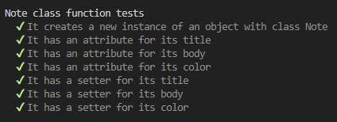
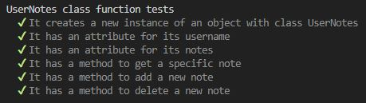
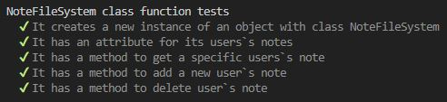
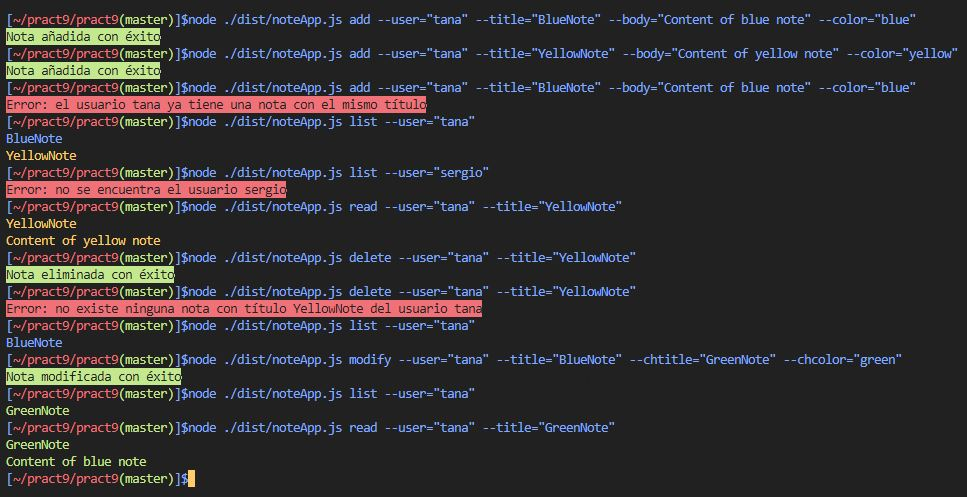

# Práctica 9: Aplicación de procesamiento de notas de texto
[](https://coveralls.io/github/ULL-ESIT-INF-DSI-2122/ull-esit-inf-dsi-21-22-prct09-filesystem-notes-app-tanafc?branch=master)
[](https://github.com/ULL-ESIT-INF-DSI-2122/ull-esit-inf-dsi-21-22-prct09-filesystem-notes-app-tanafc/actions/workflows/tests.js.yml)
[](https://sonarcloud.io/summary/new_code?id=ULL-ESIT-INF-DSI-2122_ull-esit-inf-dsi-21-22-prct09-filesystem-notes-app-tanafc)

## Objetivo
Se propone la implementación de una aplicación de procesamiento de notas de texto. En concreto, la misma permitirá añadir, modificar, eliminar, listar y leer notas de un usuario concreto. Las notas se almacenarán como ficheros JSON en el sistema de ficheros de la máquina que ejecute la aplicación. Además, solo se podrá interactuar con la aplicación desde la línea de comandos.

## Implementación
El desarrollo de esta aplicación se ha llevado a cabo mediante la implementación de diversas clases encargadas de diferentes tareas para el funcionamiento de la misma. En concreto, se distinguen las clases `Note`, `UserNotes` y `NotesFileSystem`.

### Clase Note
La clase `Note` será la encargada de almacenar la información perteneciente a una instancia de una nota. Una nota está formada por un título, un cuerpo y un color. Este último sólo podrá tomar los valores `blue`, `red`, `green` y `yellow`, por lo que se definirá un tipo propio llamado `ColorChoice` para restringir los valores. De esta manera, el código de la clase sería el siguiente:

```ts
/**
 * Type to define the available colors of a note
 */
export type ColorChoice = "yellow" | "red" | "blue" | "green";

/**
 * Class to represent a Note and its basic aytributes
 */
export class Note {
  /**
   * @param title Title of the note
   * @param body Body of the note
   * @param color Color of type ColorChoice for the note
   */
  constructor(private title: string, private body: string,
    private color: ColorChoice) {}

  /**
   * @returns The title of the note
   */
  public getTitle(): string {
    return this.title;
  }

  /**
   * @returns The body of the note
   */
  public getBody(): string {
    return this.body;
  }

  /**
   * @returns The color of the note
   */
  public getColor(): ColorChoice {
    return this.color;
  }

  /**
   * Sets a new title for the note
   * @param newTitle title for the note
   */
  public setTitle(newTitle: string): void {
    this.title = newTitle;
  }

  /**
   * Sets a new body for the note
   * @param newBody body for the note
   */
  public setBody(newBody: string): void {
    this.body = newBody;
  }

  /**
   * Sets a new color for the note
   * @param newColor color for the note
   */
  public setColor(newColor: ColorChoice): void {
    this.color = newColor;
  }
}
```

La ejecución de las pruebas mostrará la correcta implementación de la clase.



### Clase UserNote
Por otra parte, se definirá otra clase `UserNote`, la cual, almacenará las instancias de las notas de un determinado usuario, y aplicará métodos para añadir y eliminar de dicha colección. El código de dicha clase sería el siguiente:

```ts
/**
 * Class to define the attributes of a user`s notes
 */
export class UserNotes {
  /** Array that defines notes of the user */
  private userNotes: Note[];
  /** Name of the user */
  private userName: string;

  /**
   * @param name Name of the user
   * @param notes Notes of the user, if none is given,
   * its initialized as an empty array
   */
  constructor(name: string, notes: Note[] = []) {
    this.userName = name;
    this.userNotes = notes;
  }

  /**
   * @returns The username of the notes
   */
  public getUserName(): string {
    return this.userName;
  }

  /**
   * @returns The notes of the user
   */
  public getUserNotes(): Note[] {
    return this.userNotes;
  }

  /**
   * Adds a new note to the collection of notes of the user
   * @param newNote new note to add to the collection
   * @returns -1 if a note with the same title has already
   * been included, 0 otherwise.
   */
  public addNote(newNote: Note): number {
    for (let i = 0; i < this.userNotes.length; i++) {
      if (this.userNotes[i].getTitle() === newNote.getTitle()) {
        return -1;
      }
    }
    this.userNotes.push(newNote);
    return 0;
  }

  /**
   * Deletes an existing note in the user`s collection
   * @param title title of the note to delete
   * @returns 0 if the note was successfully deleted, -1 otherwise.
   */
  public deleteNote(title: string): number {
    for (let i = 0; i < this.userNotes.length; i++) {
      if (this.userNotes[i].getTitle() === title) {
        this.userNotes.splice(i, 1);
        return 0;
      }
    }
    return -1;
  }

  /**
   * Gets a determined note given the title
   * @param title title of the note to return
   * @returns the note. If the title does not match any
   * note, returns undefined.
   */
  public getNote(title: string): Note | undefined {
    for (let i = 0; i < this.userNotes.length; i++) {
      if (this.userNotes[i].getTitle() === title) {
        return this.userNotes[i];
      }
    }
    return undefined;
  }
}
```

Los atributos de `userName` y `userNotes` almacenarán el nombre del usuario y las notas del mismo. Se proporcionan a continuación getters de estos atributos, y los métodos `addNote`, que añadirá una nota a la colección del usuario si no existe una nota con un título similar, y `deleteNote`, que eliminará una nota existente del usuario dado su título. Es importante destacar el valor de retorno de ambos métodos, que será un valor numérico 0 si la acción de añadido o borrado se ha realizado correctamente, o -1 en caso contrario.

Así, la ejecución de las pruebas de esta clase mostrará su correcta implementación:



### Class NotesFileSystem
La aplicación requerirá de la persistencia de las notas de los usuarios. Para ello, una clase `NotesFileSystem` será la encargada de manejar los datos de los ficheros de las notas de los correspondientes usuarios, que se almacenarán bajo un directorio con su nombre en la carpeta `./notes`. Esta clase implementará métodos para leer y cargar los datos de la aplicación a partir de los ficheros en el directorio anterior y para poder añadir y eliminar correctamente datos de los mismos. De esta manera, el código de dicha clase será el siguiente:

```ts
/**
 * Class that defines a series of methods to manage the files
 * of a users`s notes and provides ways to add and delete notes.
 */
export class NotesFileSystem {
  /** Collection of the users`s notes */
  private usersNotes: UserNotes[] = [];

  constructor() {
    this.loadUsersData();
  }

  /**
   * @returns returns the collection of users`s notes
   */
  public getUsersNotes(): UserNotes[] {
    return this.usersNotes;
  }

  /**
   * Returns a specific user`s notes.
   * @param name name of the user to search.
   * @returns the user`s notes, undefined if the
   * name does not match any user.
   */
  public getUserNotes(name: string): UserNotes | undefined {
    for (let i = 0; i < this.usersNotes.length; i++) {
      if (this.usersNotes[i].getUserName() === name) {
        return this.usersNotes[i];
      }
    }
    return undefined;
  }

  /**
   * Reads the notes of the users under ./notes directory
   * and loads them into usersNotes.
   */
  private loadUsersData(): void {
    const usersFolders = fs.readdirSync('./notes/');
    if (usersFolders.length !== 0) {
      usersFolders.forEach((user) => {
        let notesOfUser = new UserNotes(user);
        const readNotes = fs.readdirSync(`./notes/${user}`);
        if (readNotes.length !== 0) {
          readNotes.forEach((note) => {
            const stringJSON = fs.readFileSync(`./notes/${user}/${note}`).toString();
            const noteObject = JSON.parse(stringJSON);
            notesOfUser.addNote(new Note(noteObject.title, noteObject.body, noteObject.color));
          });
        }
        this.usersNotes.push(notesOfUser);
      });
    }
  }

  /**
   * Writes a new note under the user`s directory. If the user has no directory,
   * it creates a new one with the user´s name.
   * @param user user´s directory to check.
   * @param note note to write in the file of the directory.
   */
  private writeUserData(user: string, note: Note): void {
    if (!fs.existsSync(`./notes/${user}`)) {
      fs.mkdirSync(`./notes/${user}`);
    }
    const noteObject = {
      "title": note.getTitle(),
      "body": note.getBody(),
      "color": note.getColor(),
    };
    fs.writeFileSync(`./notes/${user}/${noteObject.title}.json`, JSON.stringify(noteObject, null, "\t"));
  }

  /**
   * Deletes a user`s note given the title of the note.
   * @param user user`s note to delete.
   * @param title title of the note to delete.
   */
  private deleteUserData(user: string, title: string): void {
    if (fs.existsSync(`./notes/${user}`)) {
      fs.rmSync(`./notes/${user}/${title}.json`);
    }
  }

  /**
   * Adds a new note to the collection of notes of a user.
   * @param user user to add a new note.
   * @param newNote new note to add.
   * @returns 0 if the note was successfully added, -1
   * if there is an already existing note with the same name.
   */
  public addNewNote(user: string, newNote: Note): number {
    let userNotes = this.getUserNotes(user);
    if (typeof userNotes === "undefined") {
      userNotes = new UserNotes(user);
    }
    if (userNotes.addNote(newNote) !== -1) {
      this.writeUserData(user, newNote);
      return 0;
    } else {
      return -1;
    }
  }

  /**
   * Deletes an existing user`s note.
   * @param user user to delete a note from.
   * @param titleOfNote title of the note to delete.
   * @returns 0 if deleted successfully, -1 if there is
   * no match with the title of the note.
   */
  public deleteNote(user: string, titleOfNote: string): number {
    let userNotes = this.getUserNotes(user);
    if (typeof userNotes === "undefined") {
      return -1;
    }
    if (userNotes.deleteNote(titleOfNote) !== -1) {
      this.deleteUserData(user, titleOfNote);
      return 0;
    } else {
      return -1;
    }
  }
}
```

El método `loadUsersData` permitirá cargar los datos de los ficheros bajo el directorio `./notes` en el atributo `UsersNotes` gracias a la API síncrona de Node, que implementa funciones como `readdirSync` para leer los contenidos de los directorios y `readFileSync`, que leerá los ficheros de los usuarios, que representarán notas en formato JSON. Por otra parte, el método `writeDataUser` escribirá una nueva nota proporcionada en formato JSON bajo el directorio del usuario indicado, creando el directorio si éste no existe. Nuevamente se hace uso de las funciones de la API síncrona de Node, con `existsSync` para comprobar que el directorio existe, `mkdirSync` para crear un nuevo directorio y `writeFileSync` para crear un nuevo fichero con la nota proporcionada. Por último, `deleteUserData` eliminará una nota, esto es, un fichero del directorio del usuario indicado.

Los métodos anteriormente descritos son privados debido a que la aplicación no hará uso de ellos directamente, sino a través de los métodos `addNewNote` y `deleteNote`, que previamente realizarán las comprobaciones de si existe el usuario y la nota correspondiente para poder añadirla o eliminarla, según corresponda. Una vez comprobado, se realizará la acción adecuada y se devolverá un código de error para saber si la nota se ha añadido o eliminado correctamente del sistema de ficheros.

Un detalle importante a destacar es como, cada vez que se instancia un manejador de la clase `NotesFileSystem`, el constructor llamará a `loadUsersData` y cargará toda la información desde un principio.

La ejecución de las pruebas mostrará la correcta implementación de la clase:



### Programa principal
El programa principal se encuentra en el fichero `noteApp.ts`, el cual almacena todas las funciones para que el usuario pueda interactuar con la aplicación a través de la línea de comandos. Esto se realiza gracias al paquete `yargs`, que proporcionará métodos para poder tomar los comandos y las opciones de los mismos, y ejecutar los manejadores que llevarán a cabo las funcionalidades de la aplicación. Se han implementado manejadores para los comandos `add`, `modify`, `delete`, `list`, y `read`, que permitirán añadir, modificar, eliminar, listar y leer las notas correspondientes de los usuarios.

Cada manejador realizará las comprobaciones correspondientes de cada comando, por ejemplo, para asegurar que los títulos de las notas no se repitan y que los usuarios pasados en las opciones existan. Los mensajes informativos de cada comando se muestran en color rojo en caso de error, o verde si se ha podido ejecutar correctamente. De la misma manera, la lista o lectura de las notas se muestra con el color correspondiente de la misma. Esto es posible gracias a la inclusión del paquete `chalk`.

Un apunte importante es que, para el manejo de los datos de los ficheros y de las notas de cada usuario, al principio de la ejecución del programa se instancia un manejador de los ficheros `notesDataBase` de la siguiente manera:
```ts
/**
 * Manager of the files of the users.
 */
const notesDataBase = new NotesFileSystem();
```

Así, todas las operaciones de añadido, borrado o similares vienen proporcionadas gracias a los métodos de la clase `NotesFileSystem`.

Un ejemplo del funcionamiento de la aplicación se muestra a continuación:



### Conclusión
En esta práctica, se ha podido comprobar el funcionamiento de la API síncrona de Node, así como los paquetes de `yargs` y `chalk`, para el desarrollo de una aplicación basada en líneas de comandos. Ésto me ha permitido aprender acerca del uso de Node, así como los métodos que implementa para llevar a cabo la gestión del sistema de ficheros, lo cual resultará muy útil en futuras prácticas.
